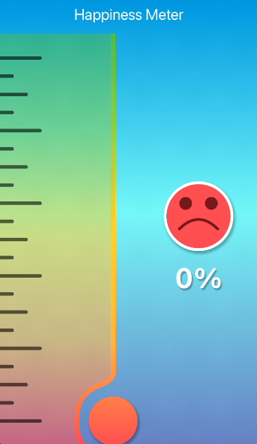
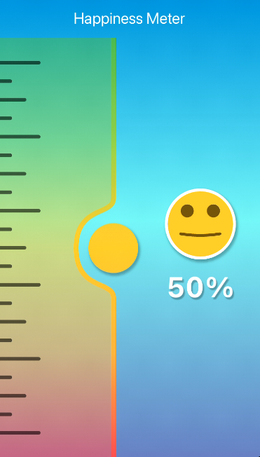
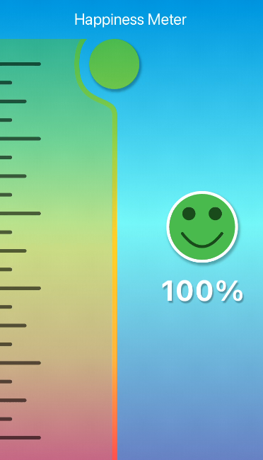

# :rocket: HAPPINESS METER :fire:

A simple app showing happiness meter.

## Inpiration

`
[![Flutter Custom UI challenge (Smart Home Humidity App)-Demo]
(https://img.youtube.com/vi/lYMxO7VQYOw/0.jpg)]
(https://www.youtube.com/shorts/lYMxO7VQYOw)
`

See on [Youtube](https://www.youtube.com/shorts/lYMxO7VQYOw)
